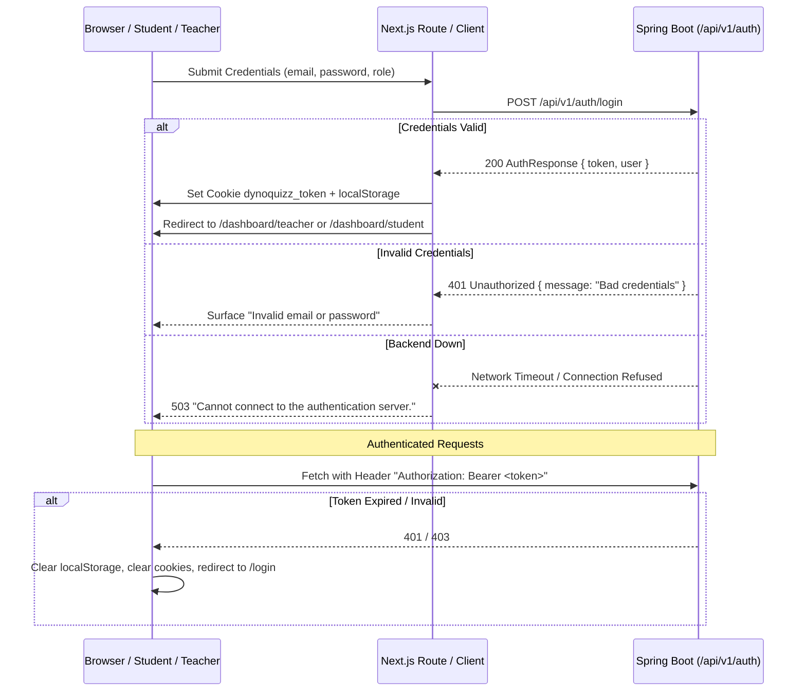

# FRONTEND_API_CONTRACT.md
# DynoQuizz / Quizly Frontend API Contract & Architecture Audit

> **Audit Date**: 2026-09-19  
> **Scope**: Next.js (App Router) Frontend Codebase (`src/app`, `src/components`, `src/hooks`, `src/lib`)  
> **Backend Base URL Variable**: `process.env.NEXT_PUBLIC_API_URL` (Default fallback in code: `http://localhost:8080`, Production in `.env.local`: `https://quiz-app-s033.onrender.com`)  
> **Purpose**: Authoritative specification of the exact HTTP endpoints, headers, request/response JSON payloads, status code handlers, storage keys, and data contracts currently implemented in the frontend.

---

## SECTION 1: Page-by-Page API Call Inventory

---

### 1. Auth Flow (`/login`, `/signup`, `/api/auth/*`, `useSession`)

#### 1.1 `POST /api/v1/auth/login`
- **Used in**:
  - `src/app/api/auth/login/route.ts` (`POST`, line 16)
  - `src/app/login/page.tsx` (`LoginContent.handleLoginSubmit`, line 80)
  - `src/hooks/useSession.ts` (`useSession.login`, line 88)
- **HTTP Method**: `POST`
- **Exact URL Path**: `${API_BASE}/api/v1/auth/login`
- **Path / Query Params**: None
- **Request Headers**:
  - `Content-Type: application/json`
- **Request Body**:
  ```json
  {
    "email": "educator@example.com",
    "password": "SecurePassword123!",
    "role": "TEACHER"
  }
  ```
  - `email` (string, required): Trimmed user email.
  - `password` (string, required): User password.
  - `role` (string, sent by frontend): `"TEACHER"` or `"STUDENT"`.
- **Response Fields Read**:
  - `data.token` or `data.accessToken` (string): JWT session token.
  - `data.role` or `data.user.role` (string): User role (`"TEACHER"` or `"STUDENT"`).
  - `data.user` (object):
    - `data.user.id` or `data.userId` (number | string): User unique identifier.
    - `data.user.fullName` or `data.user.firstName` or `data.name` (string): Display name.
    - `data.user.email` (string): User email.
- **Status Codes & Error Handling**:
  - `200 OK`: Sets cookie `dynoquizz_token`, stores `dynoquizz_token`, `dynoquizz_role`, `dynoquizz_user` in `localStorage`.
  - `401 Unauthorized` / `400 Bad Request` / Non-2xx: Reads `errorData.message || errorData.error || "Invalid email or password."`.
  - Network Failure / Fetch Exception: Returns `503 Service Unavailable` with message `"Cannot connect to the authentication server."`.
- **Status in Backend Spec**: **LIVE in backend spec** *(Note: OpenAPI `LoginRequest` schema defines only `email` and `password`; frontend also includes `role`)*.

---

#### 1.2 `POST /api/v1/auth/signup`
- **Used in**:
  - `src/app/api/auth/signup/route.ts` (`POST`, line 16)
  - `src/app/signup/page.tsx` (`SignupContent.handleSignupSubmit`, line 109)
  - `src/hooks/useSession.ts` (`useSession.signup`, line 141)
- **HTTP Method**: `POST`
- **Exact URL Path**: `${API_BASE}/api/v1/auth/signup`
- **Path / Query Params**: None
- **Request Headers**:
  - `Content-Type: application/json`
- **Request Body**:
  ```json
  {
    "firstName": "Jane",
    "lastName": "Doe",
    "name": "Jane Doe",
    "email": "jane.doe@university.edu",
    "password": "SecurePassword123!",
    "role": "TEACHER"
  }
  ```
  - `firstName` (string, required): First name.
  - `lastName` (string, required): Last name.
  - `name` (string, sent by frontend): Combined `"${firstName} ${lastName}"`.
  - `email` (string, required): Valid email address.
  - `password` (string, required): Password (min 6 characters).
  - `role` (string, required): `"TEACHER"` or `"STUDENT"`.
- **Response Fields Read**:
  - `data.token` or `data.accessToken` (string): Session JWT.
  - `data.role` or `data.user.role` (string): Assigned role.
  - `data.user` (object): User profile object.
- **Status Codes & Error Handling**:
  - `200 OK`: Persists auth session in cookie and `localStorage`.
  - `400 Bad Request` / `409 Conflict`: Reads `errorData.message || errorData.error || "Signup failed."`.
  - Network Failure: Returns `503` with `"Cannot connect to the authentication server."`.
- **Status in Backend Spec**: **LIVE in backend spec**.

---

#### 1.3 `GET /api/v1/auth/me`
- **Used in**: `src/hooks/useSession.ts` (`fetchSession`, line 42)
- **HTTP Method**: `GET`
- **Exact URL Path**: `${API_BASE}/api/v1/auth/me`
- **Path / Query Params**: None
- **Request Headers**:
  - `Authorization: Bearer ${token}`
  - `Content-Type: application/json`
- **Request Body**: None
- **Response Fields Read**:
  - `liveUserData.id` (number): User ID.
  - `liveUserData.firstName` (string): First name.
  - `liveUserData.lastName` (string): Last name.
  - `liveUserData.fullName` (string): Full name.
  - `liveUserData.email` (string): User email.
  - `liveUserData.role` (string): Role (`"TEACHER"` or `"STUDENT"`).
  - `liveUserData.registrationNo` (string, optional): Candidate roll number.
- **Status Codes & Error Handling**:
  - `200 OK`: Syncs `dynoquizz_user`, `dynoquizz_role`, and `dynoquizz_regNo` in `localStorage`.
  - `401 Unauthorized` / `403 Forbidden`: Triggers `logout()` — purges token and redirects to `/login`.
  - Network Failure: Silently keeps in-memory / cached user.
- **Status in Backend Spec**: **LIVE in backend spec**.

---

### 2. Teacher Dashboard (`/dashboard/teacher`)

#### 2.1 `GET /api/v1/teacher/quizzes`
- **Used in**: `src/app/dashboard/teacher/page.tsx` (`fetchQuizzes`, line 59)
- **HTTP Method**: `GET`
- **Exact URL Path**: `${API_BASE}/api/v1/teacher/quizzes`
- **Path / Query Params**: None
- **Request Headers**:
  - `Authorization: Bearer ${token}`
  - `Content-Type: application/json`
- **Request Body**: None
- **Response Fields Read**:
  Array of quiz objects (or wrapped in `data.content` / `data.data`):
  - `q.quizId` or `q.id` (number): Numeric database primary key.
  - `q.quizCode` or `q.testCode` (string): 6-character access code.
  - `q.teacherId` (number): ID of the creator.
  - `q.title` or `q.quizName` (string): Assessment title.
  - `q.description` (string): Description.
  - `q.instructions` (string): Examination instructions.
  - `q.subject` (string): Subject name.
  - `q.subjectCode` (string): Course / subject code.
  - `q.totalStudents` (number): Enrolled or submitted student count.
  - `q.totalQuestions` (number): Total questions count.
  - `q.overallTimerSeconds` (number): Quiz duration in seconds.
  - `q.status` (string): `"DRAFT"`, `"PUBLISHED"`, `"LIVE"`, `"COMPLETED"`, `"CANCELLED"`.
  - `q.examState` (string): `"WAITING"`, `"RUNNING"`, `"PAUSED"`, `"ENDED"`.
  - `q.resultVisibility` (string): `"NONE"`, `"LEADERBOARD"`, `"QUESTION_WISE"`, `"BOTH"`.
  - `q.resultsPublished` (boolean): Whether grades are released.
- **Status Codes & Error Handling**:
  - `200 OK`: Merges with local offline assessments, caches in `dynoquizz_teacher_quizzes`.
  - Non-200 / Network Failure: Falls back to displaying quizzes stored in `localStorage.getItem("dynoquizz_teacher_quizzes")`.
- **Status in Backend Spec**: **NOT IN BACKEND SPEC** *(Currently deployed or in migration)*.

---

### 3. Teacher Assessment Creation (`/dashboard/teacher/create`)

#### 3.1 `POST /api/v1/teacher/quizzes`
- **Used in**: `src/app/dashboard/teacher/create/page.tsx` (`handleSave`, line 478)
- **HTTP Method**: `POST`
- **Exact URL Path**: `${API_BASE}/api/v1/teacher/quizzes`
- **Path / Query Params**: None
- **Request Headers**:
  - `Authorization: Bearer ${token}`
  - `Content-Type: application/json`
- **Request Body**:
  ```json
  {
    "title": "Data Structures Midterm Examination",
    "description": "Comprehensive proctored assessment covering Trees and Graphs.",
    "instructions": "No external aids allowed. Fullscreen mode required.",
    "subject": "Computer Science",
    "subjectCode": "CS302",
    "overallTimerSeconds": 3600,
    "negativeMarking": true,
    "negativeMarks": 1,
    "timeBonusEnabled": false,
    "randomQuestionOrder": true,
    "randomOptionOrder": true,
    "allowReview": true,
    "allowResume": true,
    "autoSubmit": true,
    "startTime": "2026-09-19T10:00:00.000Z",
    "endTime": "2026-09-19T12:00:00.000Z",
    "resultVisibility": "BOTH",
    "status": "PUBLISHED",
    "allowedRolls": ["21CS001", "21CS002"],
    "totalStudents": 2,
    "questions": [
      {
        "questionText": "What is the worst-case search time complexity in an unbalanced BST?",
        "imageUrl": "",
        "explanation": "In an unbalanced BST, elements form a linear chain resulting in O(n).",
        "questionType": "MCQ",
        "marks": 4,
        "negativeMarks": 1,
        "questionTimerSeconds": 60,
        "difficulty": "MEDIUM",
        "displayOrder": 1,
        "options": [
          { "optionText": "O(log n)", "optionImage": "", "optionOrder": 1, "isCorrect": false },
          { "optionText": "O(n)", "optionImage": "", "optionOrder": 2, "isCorrect": true },
          { "optionText": "O(1)", "optionImage": "", "optionOrder": 3, "isCorrect": false },
          { "optionText": "O(n log n)", "optionImage": "", "optionOrder": 4, "isCorrect": false }
        ]
      }
    ]
  }
  ```
  *(Note: `teacherId` was intentionally omitted from the frontend body because Spring Security resolves the teacher from the JWT principal)*.
- **Response Fields Read**:
  - `data.quizId` (number, required): Primary key ID used to redirect to `/dashboard/teacher/share/${data.quizId}`.
  - `data.quizCode` (string): 6-digit access code.
  - `data.status` (string): Quiz status.
- **Status Codes & Error Handling**:
  - `200 OK`: Writes updated quiz to `localStorage.dynoquizz_teacher_quizzes` and redirects to share page.
  - Non-200: Reads `errorData.message || errorData.error || "Server returned status: " + res.status`.
- **Status in Backend Spec**: **LIVE in backend spec** *(Note: `status` and `allowedRolls` are sent in the body by frontend but absent from OpenAPI `CreateQuizRequest`)*.

---

### 4. Teacher Assessment Share Hub (`/dashboard/teacher/share/[testCode]`)

#### 4.1 `GET /api/v1/quizzes/code/{quizCode}/package`
- **Used in**: `src/app/dashboard/teacher/share/[testCode]/page.tsx` (`fetchQuizPackage`, line 75, line 87)
- **HTTP Method**: `GET`
- **Exact URL Path**: `${API_BASE}/api/v1/quizzes/code/${accessCode}/package`
- **Path / Query Params**:
  - `accessCode` / `testCode` (string): 6-character access code resolved from cache or route param.
- **Request Headers**:
  - `Authorization: Bearer ${token}` (if available)
  - `Content-Type: application/json`
- **Request Body**: None
- **Response Fields Read**:
  - `data.quizId` (number)
  - `data.title` or `data.quizName` (string)
  - `data.description` (string)
  - `data.questions` (array)
  - `data.overallTimerSeconds` (number)
  - `data.targetClass` (string)
  - `data.totalStudents` (number)
- **Status Codes & Error Handling**:
  - `200 OK`: Displays share link, QR code, and assessment details.
  - `404 Not Found`: Retries with `testCode`, then falls back to `GET /api/v1/teacher/quizzes/${testCode}`. If all fail, falls back to `localStorage` cache.
- **Status in Backend Spec**: **LIVE in backend spec**.

#### 4.2 `GET /api/v1/teacher/quizzes/{quizId}` (Fallback)
- **Used in**: `src/app/dashboard/teacher/share/[testCode]/page.tsx` (line 101)
- **HTTP Method**: `GET`
- **Exact URL Path**: `${API_BASE}/api/v1/teacher/quizzes/${testCode}`
- **Path / Query Params**: `testCode` (number or string)
- **Status in Backend Spec**: **NOT IN BACKEND SPEC** *(OpenAPI does not have `GET /teacher/quizzes/{id}`)*.

---

### 5. Teacher Live Proctoring (`/dashboard/teacher/live/[testCode]`)

#### 5.1 `GET /api/v1/quizzes/code/{quizCode}/package`
- **Used in**: `src/app/dashboard/teacher/live/[testCode]/page.tsx` (`syncTelemetry`, line 131)
- **HTTP Method**: `GET`
- **Exact URL Path**: `${API_BASE}/api/v1/quizzes/code/${quizCode}/package`
- **Path Params**: `quizCode` (string)
- **Request Headers**: `Authorization: Bearer ${token}`, `Content-Type: application/json`
- **Response Fields Read**:
  - `pkgData.quizId` (number): Resolves numeric ID for the leaderboard call.
  - `pkgData.title` or `pkgData.quizName` (string): Test title.
  - `pkgData.questions.length` or `pkgData.totalQuestions` (number): Total question count.
- **Status in Backend Spec**: **LIVE in backend spec**.

#### 5.2 `GET /api/v1/student/quizzes/{quizId}/leaderboard`
- **Used in**: `src/app/dashboard/teacher/live/[testCode]/page.tsx` (`syncTelemetry`, line 154)
- **HTTP Method**: `GET`
- **Exact URL Path**: `${API_BASE}/api/v1/student/quizzes/${numericQuizId}/leaderboard`
- **Path Params**: `numericQuizId` (number, resolved from package response)
- **Request Headers**:
  - `Authorization: Bearer ${token}`
  - `Content-Type: application/json`
- **Request Body**: None
- **Response Fields Read**:
  Array of `LeaderboardEntryResponse`:
  - `entry.rank` (number): Student rank.
  - `entry.studentId` (number): Candidate ID.
  - `entry.studentName` (string): Student name.
  - `entry.score` (number): Final score points.
  - `entry.totalMarks` (number): Maximum marks.
  - `entry.percentage` (number): Accuracy percentage.
  - `entry.totalTimeTaken` (number): Total seconds taken.
- **Status Codes & Error Handling**:
  - `200 OK`: Formats into `StudentRow` proctoring table.
  - Error: Keeps existing / local submission rows.
- **Status in Backend Spec**: **NOT IN BACKEND SPEC** *(Legacy path `GET /api/v1/quizzes/{quizId}/leaderboard` is LIVE)*.

---

### 6. Teacher Assessment Settings & Results (`/dashboard/teacher/assessment/[testCode]`)

#### 6.1 `GET /api/v1/quizzes/code/{quizCode}/package`
- **Used in**: `src/app/dashboard/teacher/assessment/[testCode]/page.tsx` (`fetchAssessmentDetails`, line 249; `handleToggleSetting`, line 430)
- **HTTP Method**: `GET`
- **Exact URL Path**: `${API_BASE}/api/v1/quizzes/code/${quizCode}/package`
- **Response Fields Read**:
  - `pkgData.quizId` (number)
  - `pkgData.title` (string)
  - `pkgData.resultVisibility` (string: `"NONE" | "LEADERBOARD" | "QUESTION_WISE" | "BOTH"`)
  - `pkgData.settings.publishScoresImmediately` (boolean)
  - `pkgData.settings.revealSolutions` (boolean)
  - `pkgData.settings.showIntegrityFlagsToStudent` (boolean)
- **Status in Backend Spec**: **LIVE in backend spec**.

#### 6.2 `GET /api/v1/student/quizzes/{quizId}/leaderboard`
- **Used in**: `src/app/dashboard/teacher/assessment/[testCode]/page.tsx` (`fetchAssessmentDetails`, line 276)
- **HTTP Method**: `GET`
- **Exact URL Path**: `${API_BASE}/api/v1/student/quizzes/${numericQuizId}/leaderboard`
- **Headers**: `Authorization: Bearer ${token}`, `Content-Type: application/json`
- **Response Fields Read**:
  - `entry.rank` (number)
  - `entry.studentId` (number)
  - `entry.studentName` or `entry.registrationNo` or `entry.username` (string)
  - `entry.score` (number)
  - `entry.percentage` (number)
  - `entry.accuracy` (number)
  - `entry.totalTimeTaken` or `entry.timeTakenSeconds` (number)
  - `entry.proctoringFlags` (array of `{ type, label, count }`)
- **Status Codes & Error Handling**:
  - `404 Not Found`: Falls back to legacy `GET /api/v1/quizzes/${numericQuizId}/leaderboard`.
- **Status in Backend Spec**: **NOT IN BACKEND SPEC** *(Legacy path is LIVE)*.

#### 6.3 `PUT /api/v1/teacher/quizzes/{quizId}/settings`
- **Used in**: `src/app/dashboard/teacher/assessment/[testCode]/page.tsx` (`handleToggleSetting`, line 458)
- **HTTP Method**: `PUT`
- **Exact URL Path**: `${API_BASE}/api/v1/teacher/quizzes/${numericQuizId}/settings`
- **Path Params**: `numericQuizId` (number, resolved from database key)
- **Request Headers**:
  - `Authorization: Bearer ${token}`
  - `Content-Type: application/json`
- **Request Body**:
  ```json
  {
    "publishScoresImmediately": true,
    "revealSolutions": true,
    "showIntegrityFlagsToStudent": false,
    "resultVisibility": "BOTH"
  }
  ```
  *(Also includes `[key]: newVal`, e.g. `"publishScoresImmediately": true`)*.
- **Response Fields Read**:
  - `updated.resultVisibility` (string: `"NONE" | "LEADERBOARD" | "QUESTION_WISE" | "BOTH"`)
  - `updated.showIntegrityFlagsToStudent` (boolean)
- **Status Codes & Error Handling**:
  - `200 OK`: Synchronizes toggle switches.
  - Non-200: Reverts toggle switch state optimistically and displays error toast from `errData.message || errData.error`.
- **Status in Backend Spec**: **NOT IN BACKEND SPEC** *(OpenAPI only has individual toggle endpoints: `/results/publish`, `/results/unpublish`, `/publish`)*.

---

### 7. Student Assessment Gateway & Lobby (`/join`, `/test/[testCode]/lobby`)

#### 7.1 `GET /api/v1/quizzes/code/{quizCode}/package`
- **Used in**:
  - `src/app/join/page.tsx` (line 92)
  - `src/app/join/[testcode]/page.tsx` (line 64)
  - `src/app/test/[testCode]/lobby/page.tsx` (line 77)
- **HTTP Method**: `GET`
- **Exact URL Path**: `${API_BASE}/api/v1/quizzes/code/${cleanCode}/package`
- **Path Params**: `cleanCode` (string, uppercase access code)
- **Request Headers**:
  - `Authorization: Bearer ${token}`
  - `Content-Type: application/json`
- **Response Fields Read**:
  - `data.quizName` or `data.title` (string)
  - `data.description` (string)
  - `data.targetClass` (string)
  - `data.overallTimerSeconds` (number)
  - `data.questions` (array of questions)
  - `data.allowedRegistrationNumbers` (array of strings, for candidate roll number authorization)
- **Status Codes & Error Handling**:
  - `404 Not Found`: Shows "Assessment Not Found" error card.
  - `!res.ok`: Reads `bodyJson.message || bodyJson.error || bodyText`.
- **Status in Backend Spec**: **LIVE in backend spec** *(Note: `allowedRegistrationNumbers` is checked by frontend but not in OpenAPI schema)*.

#### 7.2 `POST /api/v1/student/quizzes/{quizCode}/attempts`
- **Used in**: `src/app/test/[testCode]/lobby/page.tsx` (`handleStartAssessment`, line 185)
- **HTTP Method**: `POST`
- **Exact URL Path**: `${API_BASE}/api/v1/student/quizzes/${cleanCode}/attempts`
- **Path Params**: `cleanCode` (string, e.g. `"AB12CD"`)
- **Request Headers**:
  - `Authorization: Bearer ${token}`
  - `Content-Type: application/json`
- **Request Body**:
  ```json
  {
    "studentId": 42
  }
  ```
  *(Note: `studentId` is decoded from client JWT claims; backend should preferably resolve studentId from JWT principal directly)*.
- **Response Fields Read**:
  - `data.attemptId` (number): Saved to `localStorage.dynoquizz_attemptId` and `localStorage.dynoquizz_attemptId_${cleanCode}`.
- **Status Codes & Error Handling**:
  - `404 Not Found`: Falls back to legacy path `POST /api/v1/quizzes/${cleanCode}/attempts`.
  - Non-200: Reads `errorData.error || errorData.message || "Failed to initialize assessment attempt on the server."`.
- **Status in Backend Spec**: **NOT IN BACKEND SPEC** *(Legacy path `POST /api/v1/quizzes/{quizCode}/attempts` is LIVE)*.

---

### 8. Student Live Test Arena (`/test/[testCode]`)

#### 8.1 `GET /api/v1/quizzes/code/{quizCode}/package`
- **Used in**: `src/app/test/[testCode]/page.tsx` (`loadTest`, line 113)
- **HTTP Method**: `GET`
- **Exact URL Path**: `${API_BASE}/api/v1/quizzes/code/${cleanCode}/package`
- **Path Params**: `cleanCode` (string)
- **Response Fields Read**:
  - `data.title` (string)
  - `data.overallTimerSeconds` (number)
  - `data.negativeMarking` (boolean)
  - `data.allowResume` (boolean)
  - `data.questions` (array of objects):
    - `q.questionId` (number)
    - `q.questionText` (string)
    - `q.marks` (number)
    - `q.negativeMarks` (number)
    - `q.questionTimerSeconds` (number)
    - `q.options` (array of `{ optionId, optionText, optionImage }`)
- **Status in Backend Spec**: **LIVE in backend spec**.

#### 8.2 `PUT /api/v1/student/attempts/{attemptId}/answers/{questionId}`
- **Used in**: `src/app/test/[testCode]/page.tsx` (`syncAnswerToBackend`, line 193)
- **HTTP Method**: `PUT`
- **Exact URL Path**: `${API_BASE}/api/v1/student/attempts/${attemptId}/answers/${questionId}`
- **Path Params**:
  - `attemptId` (string | number, retrieved from `localStorage.dynoquizz_attemptId`)
  - `questionId` (number)
- **Request Headers**:
  - `Authorization: Bearer ${token}`
  - `Content-Type: application/json`
- **Request Body**:
  ```json
  {
    "selectedOptionIds": [2],
    "responseTimeSeconds": 14
  }
  ```
  - `selectedOptionIds` (number[], required): Array containing the single selected option ID.
  - `responseTimeSeconds` (number, required): Time spent on this question in seconds.
- **Status Codes & Error Handling**:
  - `404 Not Found`: Falls back to legacy path `PUT /api/v1/attempts/${attemptId}/answers/${questionId}`.
  - Error: Non-blocking; saves to `localStorage.dynoquizz_active_test_${cleanCode}`.
- **Status in Backend Spec**: **NOT IN BACKEND SPEC** *(Legacy path `PUT /api/v1/attempts/{attemptId}/answers/{questionId}` is LIVE)*.

#### 8.3 `POST /api/v1/student/attempts/{attemptId}/submit`
- **Used in**: `src/app/test/[testCode]/page.tsx` (`finishAssessment`, line 373)
- **HTTP Method**: `POST`
- **Exact URL Path**: `${API_BASE}/api/v1/student/attempts/${attemptId}/submit`
- **Path Params**: `attemptId` (string | number)
- **Request Headers**:
  - `Authorization: Bearer ${token}`
  - `Content-Type: application/json`
- **Request Body**:
  ```json
  {
    "answers": [
      {
        "questionId": 101,
        "selectedOptionIds": [2],
        "responseTimeSeconds": 24
      },
      {
        "questionId": 102,
        "selectedOptionIds": [4],
        "responseTimeSeconds": 15
      }
    ]
  }
  ```
  *(Skips any question where `selectedOptionId === -1` [unanswered])*.
- **Response Fields Read**:
  - `data.deadlineExceeded` (boolean)
  - `data.error` (`"EXAM_DEADLINE_EXCEEDED"`)
  - `data.finalScore` (number)
  - `data.totalMarks` (number)
  - `data.totalTimeTaken` (number)
- **Status Codes & Error Handling**:
  - `404 Not Found`: Falls back to legacy path `POST /api/v1/attempts/${attemptId}/submit`.
  - `401 Unauthorized`: Preserves answers in `localStorage` and shows `SessionExpired` resumption screen.
  - `200 OK`: Removes `dynoquizz_attemptId` and `dynoquizz_active_test_${cleanCode}` from `localStorage`.
- **Status in Backend Spec**: **NOT IN BACKEND SPEC** *(Legacy path `POST /api/v1/attempts/{attemptId}/submit` is LIVE)*.

---

### 9. Student Dashboard (`/dashboard/student`)

#### 9.1 `GET /api/v1/student/results`
- **Used in**: `src/app/dashboard/student/page.tsx` (`fetchResults`, line 31)
- **HTTP Method**: `GET`
- **Exact URL Path**: `${API_BASE}/api/v1/student/results`
- **Path / Query Params**: None
- **Request Headers**:
  - `Authorization: Bearer ${token}`
  - `Content-Type: application/json`
- **Request Body**: None
- **Response Fields Read**:
  Array of `AttemptResultResponse` objects:
  - `item.attemptId` or `item.id` (number): Attempt ID.
  - `item.quizId` (number): Parent quiz ID.
  - `item.quizTitle` or `item.quizName` or `item.title` (string): Title of the test.
  - `item.testCode` or `item.quizCode` (string): 6-digit access code (falls back to `quizId` string if omitted).
  - `item.percentage` or `item.finalScore` or `item.score` (number): Score percentage (0-100).
  - `item.totalMarks` (number): Total marks.
  - `item.totalQuestions` (number): Count of questions.
  - `item.submittedAt` (string, ISO timestamp): Time submitted.
  - `item.published` or `item.isPublished` (boolean): Whether educator has released grades.
- **Status Codes & Error Handling**:
  - `200 OK`: Authoritative source of truth; caches to `dynoquizz_student_last_results`.
  - Network Failure: Shows cached `dynoquizz_student_last_results` as resilience fallback.
- **Status in Backend Spec**: **NOT IN BACKEND SPEC**.

---

### 10. Student Scorecard / Result (`/dashboard/student/result/[testCode]`)

#### 10.1 `GET /api/v1/student/attempts/{attemptId}/result`
- **Used in**: `src/app/dashboard/student/result/[testCode]/page.tsx` (`fetchResult`, line 91)
- **HTTP Method**: `GET`
- **Exact URL Path**: `${API_BASE}/api/v1/student/attempts/${storedAttemptId}/result`
- **Path Params**: `storedAttemptId` (number | string)
- **Request Headers**:
  - `Authorization: Bearer ${token}`
  - `Content-Type: application/json`
- **Request Body**: None
- **Response Fields Read**:
  - `data.quizTitle` (string): Assessment title.
  - `data.percentage` or `data.finalScore` (number): Student percentage score.
  - `data.totalMarks` (number): Total marks.
  - `data.totalTimeTaken` (number): Seconds elapsed.
  - `data.submittedAt` (string): Submission timestamp.
  - `data.published` (boolean): Result release flag.
- **Status Codes & Error Handling**:
  - `404 Not Found`: Falls back to legacy path `GET /api/v1/attempts/${storedAttemptId}/result`.
- **Status in Backend Spec**: **NOT IN BACKEND SPEC** *(Legacy path `GET /api/v1/attempts/{attemptId}/result` is LIVE)*.

#### 10.2 `GET /api/v1/student/attempts/{attemptId}/result/details`
- **Used in**: `src/app/dashboard/student/result/[testCode]/page.tsx` (`fetchResult`, line 110)
- **HTTP Method**: `GET`
- **Exact URL Path**: `${API_BASE}/api/v1/student/attempts/${storedAttemptId}/result/details`
- **Path Params**: `storedAttemptId` (number | string)
- **Request Headers**:
  - `Authorization: Bearer ${token}`
  - `Content-Type: application/json`
- **Request Body**: None
- **Response Fields Read**:
  Array of `AttemptResultDetailResponse`:
  - `d.questionId` (number)
  - `d.questionText` (string)
  - `d.correctOptionIds` (number[])
  - `d.selectedOptionIds` (number[])
  - `d.correct` (boolean): Whether candidate's answer was correct.
  - `d.marksAwarded` (number): Marks awarded for question.
  - `d.responseTimeSeconds` (number): Time spent on question.
- **Status Codes & Error Handling**:
  - `404 Not Found`: Falls back to legacy path `GET /api/v1/attempts/${storedAttemptId}/result/details`.
- **Status in Backend Spec**: **NOT IN BACKEND SPEC** *(Legacy path is LIVE)*.

#### 10.3 `GET /api/v1/student/results/{testCode}` (Secondary Fallback)
- **Used in**: `src/app/dashboard/student/result/[testCode]/page.tsx` (line 186)
- **HTTP Method**: `GET`
- **Exact URL Path**: `${API_BASE}/api/v1/student/results/${codeUpper}`
- **Path Params**: `codeUpper` (string)
- **Status in Backend Spec**: **NOT IN BACKEND SPEC**.

---

### 11. Profile & Settings (`/settings`)

#### 11.1 `PUT /api/v1/user/profile`
- **Used in**: `src/app/settings/page.tsx` (`handleSaveProfile`, line 165)
- **HTTP Method**: `PUT`
- **Exact URL Path**: `${API_BASE}/api/v1/user/profile`
- **Request Headers**:
  - `Authorization: Bearer ${token}`
  - `Content-Type: application/json`
- **Request Body**:
  ```json
  {
    "name": "Jane Doe",
    "email": "jane.doe@university.edu",
    "institution": "Stanford University",
    "program": "Computer Science Dept"
  }
  ```
- **Response Fields Read**: None (fire-and-forget; saves to `localStorage.dynoquizz_user`).
- **Status in Backend Spec**: **NOT IN BACKEND SPEC**.

---

## SECTION A: Endpoint Summary Table

| Method | Endpoint Path | Page / File Using It | Status in Backend Spec |
|:---|:---|:---|:---|
| `POST` | `/api/v1/auth/login` | `src/app/api/auth/login/route.ts`, `src/app/login/page.tsx`, `useSession.ts` | **LIVE** |
| `POST` | `/api/v1/auth/signup` | `src/app/api/auth/signup/route.ts`, `src/app/signup/page.tsx`, `useSession.ts` | **LIVE** |
| `GET` | `/api/v1/auth/me` | `src/hooks/useSession.ts` | **LIVE** |
| `GET` | `/api/v1/quizzes/code/{quizCode}/package` | `src/app/join/page.tsx`, `join/[testcode]`, `test/[testCode]/lobby`, `test/[testCode]`, `teacher/share`, `teacher/live`, `teacher/assessment` | **LIVE** |
| `POST` | `/api/v1/teacher/quizzes` | `src/app/dashboard/teacher/create/page.tsx` | **LIVE** |
| `GET` | `/api/v1/teacher/quizzes` | `src/app/dashboard/teacher/page.tsx` | **NOT IN BACKEND SPEC** (Migration) |
| `GET` | `/api/v1/teacher/quizzes/{testCode}` | `src/app/dashboard/teacher/share/[testCode]`, `teacher/assessment/[testCode]` | **NOT IN BACKEND SPEC** |
| `PUT` | `/api/v1/teacher/quizzes/{quizId}/settings` | `src/app/dashboard/teacher/assessment/[testCode]/page.tsx` | **NOT IN BACKEND SPEC** (Migration) |
| `POST` | `/api/v1/student/quizzes/{quizCode}/attempts` | `src/app/test/[testCode]/lobby/page.tsx` | **NOT IN BACKEND SPEC** (Migration) |
| `POST` | `/api/v1/quizzes/{quizCode}/attempts` | `src/app/test/[testCode]/lobby/page.tsx` (404 Fallback), `join/[testcode]` | **LIVE** (Legacy) |
| `PUT` | `/api/v1/student/attempts/{attemptId}/answers/{questionId}` | `src/app/test/[testCode]/page.tsx` | **NOT IN BACKEND SPEC** (Migration) |
| `PUT` | `/api/v1/attempts/{attemptId}/answers/{questionId}` | `src/app/test/[testCode]/page.tsx` (404 Fallback) | **LIVE** (Legacy) |
| `POST` | `/api/v1/student/attempts/{attemptId}/submit` | `src/app/test/[testCode]/page.tsx` | **NOT IN BACKEND SPEC** (Migration) |
| `POST` | `/api/v1/attempts/{attemptId}/submit` | `src/app/test/[testCode]/page.tsx` (404 Fallback) | **LIVE** (Legacy) |
| `GET` | `/api/v1/student/quizzes/{quizId}/leaderboard` | `src/app/dashboard/teacher/live/[testCode]`, `teacher/assessment/[testCode]` | **NOT IN BACKEND SPEC** (Migration) |
| `GET` | `/api/v1/quizzes/{quizId}/leaderboard` | `src/app/dashboard/teacher/assessment/[testCode]` (404 Fallback) | **LIVE** (Legacy) |
| `GET` | `/api/v1/student/results` | `src/app/dashboard/student/page.tsx` | **NOT IN BACKEND SPEC** (Migration) |
| `GET` | `/api/v1/student/attempts/{attemptId}/result` | `src/app/dashboard/student/result/[testCode]/page.tsx` | **NOT IN BACKEND SPEC** (Migration) |
| `GET` | `/api/v1/attempts/{attemptId}/result` | `src/app/dashboard/student/result/[testCode]/page.tsx` (404 Fallback) | **LIVE** (Legacy) |
| `GET` | `/api/v1/student/attempts/{attemptId}/result/details` | `src/app/dashboard/student/result/[testCode]/page.tsx` | **NOT IN BACKEND SPEC** (Migration) |
| `GET` | `/api/v1/attempts/{attemptId}/result/details` | `src/app/dashboard/student/result/[testCode]/page.tsx` (404 Fallback) | **LIVE** (Legacy) |
| `GET` | `/api/v1/student/results/{testCode}` | `src/app/dashboard/student/result/[testCode]/page.tsx` (Secondary fallback) | **NOT IN BACKEND SPEC** |
| `PUT` | `/api/v1/user/profile` | `src/app/settings/page.tsx` | **NOT IN BACKEND SPEC** |

---

## SECTION B: Enum Values Used in Code

The frontend relies on the exact strings below (case-sensitive):

1. **`role`**:
   - `"TEACHER"`, `"STUDENT"` (Normalized uppercase across API calls & session cache).
   - In UI route params / props: `"teacher"`, `"student"`, `"instructor"`, `"educator"`, `"candidate"`.
2. **`resultVisibility`**:
   - `"NONE"`: Neither leaderboard nor answers released.
   - `"LEADERBOARD"`: Overall rank and score visible, question breakdown hidden.
   - `"QUESTION_WISE"`: Question answers/solutions visible, leaderboard hidden.
   - `"BOTH"`: Full leaderboard and question-wise solutions released.
3. **`status` (Quiz Entity)**:
   - `"DRAFT"`: Incomplete / unpublished assessment.
   - `"PUBLISHED"`: Active test visible to candidates.
   - `"LIVE"`: Equivalent to `"PUBLISHED"` in UI filter.
   - `"COMPLETED"`: Finished test.
   - `"CANCELLED"`: Voided test.
   - `"ENDED"`: Handled in legacy storage types.
4. **`examState`**:
   - `"WAITING"`, `"RUNNING"`, `"PAUSED"`, `"ENDED"`.
   - Used in `TeacherDashboard` to compute the "Active / Live Sessions" counter (`examState === "RUNNING"`).
5. **`questionType`**:
   - `"MCQ"` (Multiple Choice Question, default), `"MSQ"` (Multiple Selection), `"TRUE_FALSE"`.
6. **`difficulty`**:
   - `"EASY"`, `"MEDIUM"`, `"HARD"`.
7. **`answerStatus` (Attempt Result Detail)**:
   - `"ANSWERED"`, `"UNANSWERED"`, `"MARKED_FOR_REVIEW"`.
8. **`proctoringFlag.type`**:
   - `"tab_switch"`, `"fullscreen_exit"`, `"right_click"`, `"copy_attempt"`.

---

## SECTION C: Concept Naming Inconsistencies Across Frontend

| Concept | Frontend Variants | Files Using Each Variant | Resolution Recommendation |
|:---|:---|:---|:---|
| **Access Code** | `quizCode`<br>`testCode`<br>`testcode`<br>`accessCode`<br>`code` | `create/page.tsx`, `quizCache.ts`, `teacher/page.tsx`<br>`test/[testCode]`, `assessment/[testCode]`, `live/[testCode]`, `types.ts`, `storage.ts`<br>`join/[testcode]/page.tsx` (all lowercase)<br>`join/page.tsx`, `share/[testCode]/page.tsx`<br>`teacher/page.tsx`, `storage.ts` | Standardize backend DTOs to provide **both** `quizCode` and `testCode` as identical strings. |
| **Quiz ID** | `quizId`<br>`id` | `create/page.tsx`, `teacher/page.tsx`, `live/page.tsx`, `assessment/page.tsx`<br>`types.ts`, `storage.ts`, fallback `(q.quizId ?? q.id)` across cards | Provide numeric `quizId` and echo `id: quizId` in all response objects. |
| **Quiz Title** | `title`<br>`quizName`<br>`quizTitle` | `create/page.tsx`, `teacher/page.tsx`, `lobby/page.tsx`, `package` responses<br>`types.ts`, `storage.ts`, `live/page.tsx`, `student/page.tsx`<br>`AttemptResultResponse`, `student/result/page.tsx`, `student/page.tsx` | Provide `title` and alias `quizTitle: title` / `quizName: title`. |
| **Score Metric** | `score`<br>`percentage`<br>`finalScore` | `StudentRecord`, `StudentTestResult`, `LeaderboardEntryResponse`<br>`LeaderboardEntryResponse`, `AttemptResultResponse`, `StudentResultPage`<br>`SubmitAttemptResponse`, `AttemptResultResponse` | In result DTOs, return `finalScore` (points) and `percentage` (0-100). |
| **Time Metric** | `overallTimerSeconds`<br>`totalTimeLimitMinutes`<br>`totalTimeTaken`<br>`timeTakenTotalSeconds` | `create/page.tsx`, `package` response, `teacher/page.tsx`<br>`types.ts`, `lobby/page.tsx`, `storage.ts`<br>`SubmitAttemptResponse`, `AttemptResultResponse`, `LeaderboardEntryResponse`<br>`StudentTestResult`, `student/result/page.tsx` | Return durations in seconds (`overallTimerSeconds`, `totalTimeTaken`). |

---

## SECTION D: Path & Identifier Anomalies

1. **`studentId` in `StartAttemptRequest` Body (`src/app/test/[testCode]/lobby/page.tsx:194`)**:
   - The frontend decodes the client JWT claim `(decoded.id || decoded.userId || decoded.sub)` and sends `{ "studentId": <id> }` in `POST /api/v1/student/quizzes/{quizCode}/attempts`.
   - *Backend Action*: Spring Boot should resolve the authenticated student directly from `SecurityContextHolder.getContext().getAuthentication().getPrincipal()` instead of relying on the client body.
2. **Missing `testCode` in `AttemptResultResponse` (`src/app/dashboard/student/page.tsx:52`)**:
   - `GET /api/v1/student/results` returns items matching `AttemptResultResponse` (`attemptId`, `quizId`, `quizTitle`, `percentage`, `submittedAt`).
   - The student dashboard card needs to render the test access code pill and link to `/dashboard/student/result/${testCode}`. Because `testCode` is missing from `AttemptResultResponse`, the frontend currently falls back to `item.quizId` as string.
   - *Backend Action*: Add `"testCode": "string"` (e.g. `"quizCode": "AB12CD"`) to `AttemptResultResponse`.
3. **Empty Body on Legacy Start Attempt (`src/app/join/[testcode]/page.tsx:134`)**:
   - The direct route `/join/[testcode]` calls `POST /api/v1/quizzes/${cleanCode}/attempts` with **no body**, while the lobby page sends `{ "studentId": <number> }`.
4. **Extra Fields in `CreateQuizRequest` (`src/app/dashboard/teacher/create/page.tsx:454`)**:
   - Frontend sends `"status": "PUBLISHED"` and `"allowedRolls": ["21CS01", "21CS02"]`. The OpenAPI `CreateQuizRequest` spec does not define either field.

---

## SECTION E: Browser Storage Keys (`localStorage` & `sessionStorage`)

### `localStorage` Keys

| Key Name | Type / Stored Content | Written By | Read By | Is Source of Truth? |
|:---|:---|:---|:---|:---|
| `dynoquizz_token` | Raw JWT string (`header.payload.signature`) | `login/page.tsx`, `signup/page.tsx`, `useSession.ts`, `AuthForm.tsx`, cookie sync | Every authenticated page & hook | **Yes** (Client auth credential) |
| `dynoquizz_user` | JSON `{ id, email, role, name, fullName, institution, program }` | `login/page.tsx`, `signup/page.tsx`, `useSession.ts`, `settings/page.tsx` | `TopNav.tsx`, `ProfileDropdown.tsx`, `settings/page.tsx` | No (Cache; live data refreshed via `GET /api/v1/auth/me`) |
| `dynoquizz_role` | String: `"TEACHER"` or `"STUDENT"` | `login/page.tsx`, `signup/page.tsx`, `useSession.ts`, `AuthForm.tsx` | `TopNav.tsx`, `proxy.ts`, `login/page.tsx` | No (Cache of JWT role claim) |
| `dynoquizz_regNo` | String: Candidate roll number (e.g. `"21CS042"`) | `join/page.tsx`, `join/[testcode]`, `verify/page.tsx`, `lobby/page.tsx`, `useSession.ts` | `lobby/page.tsx`, `verify/page.tsx`, `test/page.tsx` | **Yes** (Identifies candidate across session tabs) |
| `dynoquizz_attemptId` | String: Numeric active attempt ID (e.g. `"15"`) | `lobby/page.tsx`, `join/[testcode]/page.tsx` | `test/page.tsx`, `student/result/page.tsx` | **Yes** (Active attempt session tracking) |
| `dynoquizz_attemptId_${cleanCode}` | String: Attempt ID keyed by test code | `lobby/page.tsx` | `test/page.tsx`, `student/result/page.tsx` | **Yes** (Scoped attempt tracking) |
| `dynoquizz_active_test_${cleanCode}` | JSON: `{ answers: Record<qId, optId>, timeTaken: Record<qId, sec>, lastUpdated }` | `test/[testCode]/page.tsx` | `test/[testCode]/page.tsx` | **Yes** (Zero-latency offline recovery mid-exam) |
| `dynoquizz_teacher_quizzes` | JSON array of hydrated quiz objects | `teacher/create/page.tsx`, `teacher/page.tsx` | `teacher/page.tsx`, `teacher/share/page.tsx`, `quizCache.ts` | No (Local roster cache merged with `GET /teacher/quizzes`) |
| `dynoquizz_quizzes_${teacherId}` | JSON array of created quizzes | `lib/quizCache.ts` | `lib/quizCache.ts` | No (Legacy teacher roster cache) |
| `dynoquizz_student_last_results` | JSON array of `AttemptResultResponse` items | `src/app/dashboard/student/page.tsx` | `src/app/dashboard/student/page.tsx` | No (Resilience cache used only on network failure) |
| `dynoquizz_tests` | JSON array of `QuizTest` | `lib/storage.ts` | `lib/storage.ts`, `student/result/page.tsx` | No (Legacy offline test store) |
| `dynoquizz_results` | JSON array of `StudentTestResult` | `lib/storage.ts` | `lib/storage.ts` | No (Legacy offline results store) |
| `dynoquizz_result_${testCode}` | JSON of single `StudentTestResult` | `lib/storage.ts` | `lib/storage.ts`, `student/result/page.tsx` | No (Legacy single submission cache) |

### `sessionStorage` Keys

| Key Name | Type / Stored Content | Written By | Read By | Purpose |
|:---|:---|:---|:---|:---|
| `dynoquizz_student_reg` | String: Candidate roll number | `join/page.tsx`, `join/[testcode]`, `verify/page.tsx`, `lobby/page.tsx` | `lobby/page.tsx`, `test/page.tsx` | Per-tab candidate identity memory |
| `dynoquizz_pkg_${cleanCode}` | String: `"true"` | `src/app/test/[testCode]/lobby/page.tsx` | `lobby/page.tsx` | Tracks whether candidate has downloaded and cached package |

---

## SECTION F: UI Data Lacking Backing Backend APIs

1. **Candidate Whitelist Verification (`src/app/join/page.tsx:129`)**:
   - UI checks `backendPackage.allowedRegistrationNumbers.some(r => r === cleanReg)`.
   - *Backend Gap*: `GET /api/v1/quizzes/code/{quizCode}/package` does not include `allowedRegistrationNumbers` in its OpenAPI schema.
2. **Proctoring Flag Stream (`src/app/dashboard/teacher/live/[testCode]/page.tsx:442`)**:
   - UI displays flagged student icons (`tab_switch`, `fullscreen_exit`, `copy_attempt`).
   - *Backend Gap*: There is no WebSocket or server-sent events telemetry endpoint. Leaderboard only returns scores, so live flags currently show `—` for real backend candidates.
3. **Student Profile Updates (`src/app/settings/page.tsx:165`)**:
   - UI allows editing institution and program, and displays profile pictures.
   - *Backend Gap*: `PUT /api/v1/user/profile` does not exist in Spring Boot.
4. **Draft Quiz Storage**:
   - Draft assessments are held only in `localStorage.dynoquizz_teacher_quizzes` under `status: "DRAFT"`. There is no draft storage endpoint on the server.

---

## SECTION G: Authentication & Session Lifecycle



1. **Token Persistence**: Stored in both `localStorage.getItem("dynoquizz_token")` and `document.cookie` (`dynoquizz_token=<jwt>; path=/`).
2. **Header Injection**: Every API call retrieves the token and injects:
   `Authorization: Bearer ${token}`
3. **401 Handling**:
   - Global session hook `useSession.ts` catches `401 / 403` on `/auth/me` and triggers `logout()`, removing all credentials and routing to `/login`.
   - Mid-quiz in `src/app/test/[testCode]/page.tsx`, a 401 catches safely without losing progress, saves candidate answers in `dynoquizz_active_test_${cleanCode}`, and renders a resumption modal allowing candidate to re-login and submit.
4. **Role Partitioning**:
   - Resolved from JWT payload or `data.user.role`.
   - Stored in uppercase (`"TEACHER"`, `"STUDENT"`).
   - Middleware `proxy.ts` strictly prevents students from accessing `/dashboard/teacher/*` and teachers from accessing `/dashboard/student/*`.

---

## SECTION H: Backend Implementation Plan for Missing Endpoints

The following exact JSON request and response payloads must be implemented by the Spring Boot backend team.

---

### Priority 1: Student Attempt Flow

#### H1. `POST /api/v1/student/quizzes/{quizCode}/attempts`
- **Purpose**: Initialize an assessment session for a student.
- **Headers**: `Authorization: Bearer <JWT>`, `Content-Type: application/json`
- **Request Body**:
  ```json
  {
    "studentId": 42
  }
  ```
  *(Note: Backend must tolerate missing `studentId` and derive ID from principal)*.
- **Expected Response (200 OK)**:
  ```json
  {
    "attemptId": 105,
    "quizId": 12,
    "studentId": 42,
    "startedAt": "2026-09-19T10:00:00.000Z",
    "status": "IN_PROGRESS",
    "currentQuestion": 1,
    "totalTimeTaken": 0
  }
  ```

#### H2. `PUT /api/v1/student/attempts/{attemptId}/answers/{questionId}`
- **Purpose**: Persist a single question answer in real-time.
- **Headers**: `Authorization: Bearer <JWT>`, `Content-Type: application/json`
- **Request Body**:
  ```json
  {
    "selectedOptionIds": [204],
    "responseTimeSeconds": 18
  }
  ```
- **Expected Response (200 OK)**:
  ```json
  {
    "answerId": 5012,
    "attemptId": 105,
    "questionId": 401,
    "selectedOptionIds": [204],
    "responseTimeSeconds": 18,
    "answeredAt": "2026-09-19T10:05:18.000Z"
  }
  ```

#### H3. `POST /api/v1/student/attempts/{attemptId}/submit`
- **Purpose**: Final exam submission with candidate answer batch.
- **Headers**: `Authorization: Bearer <JWT>`, `Content-Type: application/json`
- **Request Body**:
  ```json
  {
    "answers": [
      {
        "questionId": 401,
        "selectedOptionIds": [204],
        "responseTimeSeconds": 18
      },
      {
        "questionId": 402,
        "selectedOptionIds": [208],
        "responseTimeSeconds": 32
      }
    ]
  }
  ```
- **Expected Response (200 OK)**:
  ```json
  {
    "attemptId": 105,
    "quizId": 12,
    "status": "SUBMITTED",
    "finalScore": 85,
    "totalMarks": 100,
    "totalTimeTaken": 1850,
    "submittedAt": "2026-09-19T10:30:50.000Z",
    "deadlineExceeded": false
  }
  ```

---

### Priority 2: Teacher Management Flow

#### H4. `GET /api/v1/teacher/quizzes`
- **Purpose**: Fetch all assessments created by the authenticated teacher.
- **Headers**: `Authorization: Bearer <JWT>`
- **Expected Response (200 OK)**:
  ```json
  [
    {
      "quizId": 12,
      "quizCode": "CS3021",
      "teacherId": 5,
      "title": "Data Structures Midterm Examination",
      "description": "Proctored midterm exam covering trees, heaps, and graphs.",
      "instructions": "Fullscreen required. No external notes.",
      "subject": "Computer Science",
      "subjectCode": "CS302",
      "totalStudents": 45,
      "totalQuestions": 25,
      "totalMarks": 100,
      "overallTimerSeconds": 3600,
      "negativeMarking": true,
      "negativeMarks": 1,
      "timeBonusEnabled": false,
      "randomQuestionOrder": true,
      "randomOptionOrder": true,
      "allowReview": true,
      "allowResume": true,
      "autoSubmit": true,
      "startTime": "2026-09-19T10:00:00.000Z",
      "endTime": "2026-09-19T12:00:00.000Z",
      "resultVisibility": "BOTH",
      "resultsPublished": true,
      "status": "PUBLISHED",
      "examState": "RUNNING"
    }
  ]
  ```

#### H5. `PUT /api/v1/teacher/quizzes/{quizId}/settings`
- **Purpose**: Update assessment visibility and release toggles dynamically.
- **Headers**: `Authorization: Bearer <JWT>`, `Content-Type: application/json`
- **Request Body**:
  ```json
  {
    "publishScoresImmediately": true,
    "revealSolutions": true,
    "showIntegrityFlagsToStudent": false,
    "resultVisibility": "BOTH"
  }
  ```
- **Expected Response (200 OK)**:
  ```json
  {
    "quizId": 12,
    "resultVisibility": "BOTH",
    "publishScoresImmediately": true,
    "revealSolutions": true,
    "showIntegrityFlagsToStudent": false
  }
  ```

#### H6. `GET /api/v1/student/quizzes/{quizId}/leaderboard`
- **Purpose**: Teacher and student assessment leaderboard rankings.
- **Headers**: `Authorization: Bearer <JWT>`
- **Expected Response (200 OK)**:
  ```json
  [
    {
      "rank": 1,
      "studentId": 42,
      "studentName": "Alex Chen",
      "score": 96,
      "totalMarks": 100,
      "percentage": 96,
      "totalTimeTaken": 1420
    },
    {
      "rank": 2,
      "studentId": 89,
      "studentName": "Sarah Jenkins",
      "score": 92,
      "totalMarks": 100,
      "percentage": 92,
      "totalTimeTaken": 1680
    }
  ]
  ```

---

### Priority 3: Student Results & Scorecard

#### H7. `GET /api/v1/student/results`
- **Purpose**: Authoritative list of all assessments taken by authenticated student.
- **Headers**: `Authorization: Bearer <JWT>`
- **Expected Response (200 OK)**:
  ```json
  [
    {
      "attemptId": 105,
      "quizId": 12,
      "quizTitle": "Data Structures Midterm Examination",
      "testCode": "CS3021",
      "studentId": 42,
      "status": "SUBMITTED",
      "finalScore": 85,
      "totalMarks": 100,
      "percentage": 85,
      "totalQuestions": 25,
      "totalTimeTaken": 1850,
      "startedAt": "2026-09-19T10:00:00.000Z",
      "submittedAt": "2026-09-19T10:30:50.000Z",
      "published": true
    }
  ]
  ```

#### H8. `GET /api/v1/student/attempts/{attemptId}/result`
- **Purpose**: Overall scorecard for a single submission.
- **Headers**: `Authorization: Bearer <JWT>`
- **Expected Response (200 OK)**:
  ```json
  {
    "attemptId": 105,
    "quizId": 12,
    "quizTitle": "Data Structures Midterm Examination",
    "studentId": 42,
    "status": "SUBMITTED",
    "finalScore": 85,
    "totalMarks": 100,
    "percentage": 85,
    "totalTimeTaken": 1850,
    "startedAt": "2026-09-19T10:00:00.000Z",
    "submittedAt": "2026-09-19T10:30:50.000Z"
  }
  ```

#### H9. `GET /api/v1/student/attempts/{attemptId}/result/details`
- **Purpose**: Question-by-question breakdown with chosen and correct option IDs.
- **Headers**: `Authorization: Bearer <JWT>`
- **Expected Response (200 OK)**:
  ```json
  [
    {
      "questionId": 401,
      "questionText": "What is the worst-case search time complexity in an unbalanced BST?",
      "displayOrder": 1,
      "selectedOptionIds": [204],
      "correctOptionIds": [204],
      "answerStatus": "ANSWERED",
      "correct": true,
      "marksAwarded": 4,
      "questionMarks": 4,
      "responseTimeSeconds": 18
    },
    {
      "questionId": 402,
      "questionText": "Which data structure is primarily used to implement BFS on a graph?",
      "displayOrder": 2,
      "selectedOptionIds": [207],
      "correctOptionIds": [208],
      "answerStatus": "ANSWERED",
      "correct": false,
      "marksAwarded": -1,
      "questionMarks": 4,
      "responseTimeSeconds": 32
    }
  ]
  ```

---

### Priority 4: User Profile

#### H10. `PUT /api/v1/user/profile`
- **Purpose**: Update user information.
- **Headers**: `Authorization: Bearer <JWT>`, `Content-Type: application/json`
- **Request Body**:
  ```json
  {
    "name": "Jane Doe",
    "email": "jane.doe@university.edu",
    "institution": "Stanford University",
    "program": "Computer Science"
  }
  ```
- **Expected Response (200 OK)**:
  ```json
  {
    "id": 5,
    "fullName": "Jane Doe",
    "email": "jane.doe@university.edu",
    "college": "Stanford University",
    "department": "Computer Science",
    "role": "TEACHER"
  }
  ```

---

## SECTION I: Checklist of All Scanned Files

Every source file in the repository was inspected during this audit:

- [x] `src/app/api/auth/login/route.ts`
- [x] `src/app/api/auth/logout/route.ts`
- [x] `src/app/api/auth/session/route.ts`
- [x] `src/app/api/auth/signup/route.ts`
- [x] `src/app/dashboard/student/page.tsx`
- [x] `src/app/dashboard/student/error.tsx`
- [x] `src/app/dashboard/student/result/[testCode]/page.tsx`
- [x] `src/app/dashboard/teacher/page.tsx`
- [x] `src/app/dashboard/teacher/error.tsx`
- [x] `src/app/dashboard/teacher/create/page.tsx`
- [x] `src/app/dashboard/teacher/share/[testCode]/page.tsx`
- [x] `src/app/dashboard/teacher/live/[testCode]/page.tsx`
- [x] `src/app/dashboard/teacher/assessment/[testCode]/page.tsx`
- [x] `src/app/join/page.tsx`
- [x] `src/app/join/error.tsx`
- [x] `src/app/join/[testcode]/page.tsx`
- [x] `src/app/login/page.tsx`
- [x] `src/app/signup/page.tsx`
- [x] `src/app/settings/page.tsx`
- [x] `src/app/test/[testCode]/lobby/page.tsx`
- [x] `src/app/test/[testCode]/verify/page.tsx`
- [x] `src/app/test/[testCode]/page.tsx`
- [x] `src/app/test/[testCode]/error.tsx`
- [x] `src/app/layout.tsx`
- [x] `src/app/page.tsx`
- [x] `src/components/AuthForm.tsx`
- [x] `src/components/TopNav.tsx`
- [x] `src/components/ProfileDropdown.tsx`
- [x] `src/components/Logo.tsx`
- [x] `src/components/ThemeProvider.tsx`
- [x] `src/components/ErrorBoundary.tsx`
- [x] `src/components/WaveText.tsx`
- [x] `src/hooks/useSession.ts`
- [x] `src/hooks/useProctoring.ts`
- [x] `src/lib/constants.ts`
- [x] `src/lib/jwt.ts`
- [x] `src/lib/quizCache.ts`
- [x] `src/lib/scoring.ts`
- [x] `src/lib/storage.ts`
- [x] `src/lib/types.ts`
- [x] `src/proxy.ts`
- [x] `.env.local`
